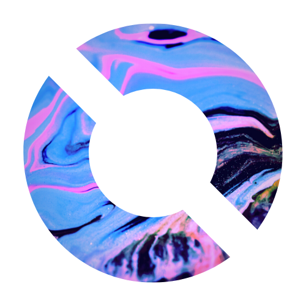

<title>

Orbital Desktop Environment

</title>

<link rel="shortcut icon" type="image/png" href="../assets/logo.png">

<h3 style="text-align: center;">

<a href="https://OrbitalDE.github.io">Home</a> | <a href="../download">Download</a> | <a href="#">News</a> | <a href="../screenshots">Screenshots</a>

</h3>

# Orbital - Development Roadmap

Development Roadmap for Orbital `v1.1`

**Development Roadmap**
- [x] Planning stage
    - [x] Feature discussion with Linux users and those interested
    - [x] Implementation discussion among developers
- [ ] Development
- [ ] Testing
- [ ] Release

**Planned features:**
- [ ] Provide functionality for `Alt` + `Tab` by utilising the Rofi Window Switcher.
    - [ ] Create custom Rofi configuration for `Alt` + `Tab` (Don't enter in full-screen App Grid)
- [ ] Modify Rofi App Grid to have rounded corners and use less contrasting colours.
- [ ] Provide logout menu when pressing `Super` +  `Shift` + `E` with Rofi.
    - [ ] Utilise a different configuration file for the logout menu.
- [ ] Replace the tint2 bar with a customised lemonbar

Made with ❤️ by <a href="https://github.com/httpllamaz" target="_blank">http.llamaz</a> | <a href="https://github.com/OrbitalDE" target="_blank">Source Code</a>

